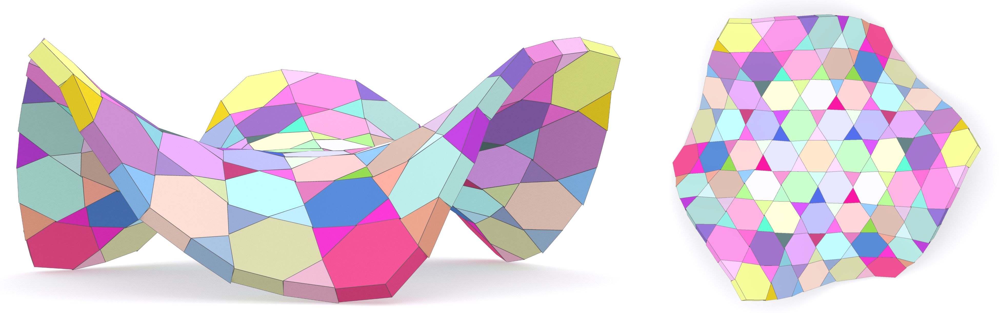
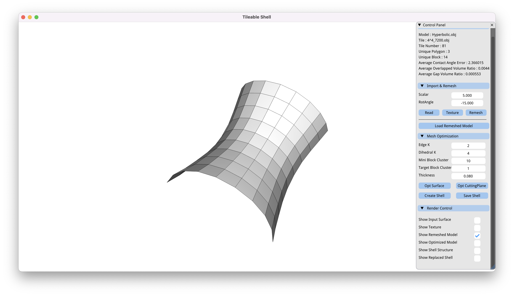
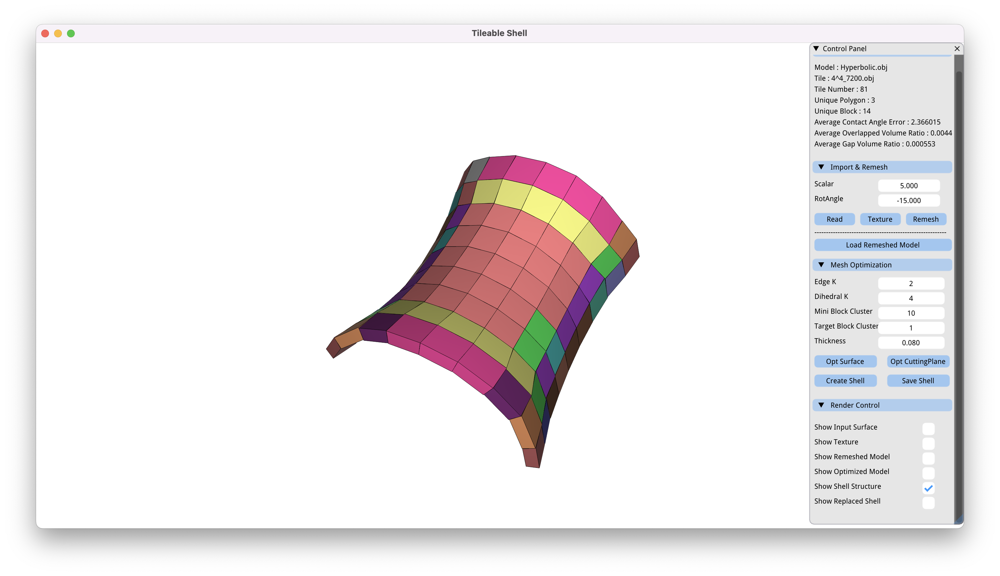

<p align="center">
 
</p>

<h3 align="center">Masonry Shell Structures with Discrete Equivalence Classes</h3>

<div align="center">

  []() 
  [](/LICENSE)

</div>

This repo is an implementation of [Masonry Shell Structures with Discrete Equivalence Classes](doc/Paper.pdf) [Chen et al. 2023]. Commercial licensing is available upon request. If you have any problems when using this code, you can contact me any time through rulin_chen@mymail.sutd.edu.sg.

If you make use of this repo in your scientific work, please cite our paper. For your convenience,
you can use the following bibtex snippet:

    @article {Chen-2023-MasonryShell,
    author   = {Rulin Chen and Pengyun Qiu and Peng Song and Bailin Deng and  Ziqi Wang and Ying He},
    title        = {Masonry Shell Structures with Discrete Equivalence Classes},
    journal   = {ACM Transactions on Graphics (SIGGRAPH 2023)},
    year      = {2023}}

## Table of Contents
- [About](#about)
- [Getting Started](#getting_started)
- [GUI Interface](#usage)
- [Create a Masonry Shell Structures with Discrete Equivalence Classes!](#create_puzzle)
- [Authors](#authors)
- [Acknowledgments](#acknowledgement)

## About <a name = "about"></a>
This repo presents a computational approach to design high-level interlocking puzzles. We implemented our computational design tool in C++ and `libigl` [Jacobson et al. 2018] on a desktop computer with 3.6 GHz 8-Core Intel processor and 16 GB RAM. 

## Getting Started <a name = "getting_started"></a>
Our code can be ran on MacOS and Unbuntu (Linux) system. First clone the repository, run CMake to generate Makefiles or CMake/Visual Studio project files, and the rest should just work automatically.

### Compilation

- **MacOS and Ubuntu(Linux)**:

```
$ cd [current folder path]
$ mkdir build
$ cd build
$ cmake ..
$ make -j 16
```
The integer following make -j is the number of threads supported by your CPU architecture. Replace it with your optimal value.

- **Windows**: our code can be run on VM16 + Ubuntu 20.04 environment.


## GUI Interface <a name = "usage"></a>
The control panel is shown below. There are 4 components in the control panel: **Status Bar**, **Import & Remesh**, **Mesh Optimization** and **Render Control**.
<p align="center">
 
</p>

- ### Status Bar

  `Model` Display the imported surface name.

  `Tile` Display the imported tile pattern name.

  `Tile Number` Display the number of tiles after remeshing.

  `Unique Polygon` Display the number of polygon templates.

  `Unique Block` Display the number of block templates.

- ### Import & Remesh

  `Scalar`  Determine the scalar of the input tile pattern.
  
  `RotAngle` Determine the rotation angle of the input tile pattern. 
  
  `Read` Load the input surface.
  
  `Texture` Load the input tile pattern.

  `Remesh` Map the 2D tile pattern to input surface using ARAP initialization.

  `Load Remeshed Mesh` Load the remeshed input mesh.

  `Avg Contact Angle Error`, `Avg Overlap Ratio` and `Avg Gap Ratio` are three error metrics defined in Section 3 of our paper.

- ### Mesh Optimization

  `Edge K` Determine the target cluster number of edge length. 

  `Dihedral K` Determine the target cluster number of dihedral angle.

  `Mini Block Cluster` Determine the threshold to define if the block cluster is considered to be merged.

  `Target Block Cluster` Determine the threshold to stop the block cluster merging operation. 

  `Thickness` Determine the thickness of each shell block.

  `Opt Surface` Optimize surface to reach lower number of polygon templates.

  `Opt Cutting Plane` Optimize cutting plane to reach lower number of shell block templates.

  `Create Shell` Create shell structure based on given thickness. 

  `Save Shell` Save optimzied shell structure data. 

- ### Render Control
  Control the object visualization state.

## Create a Masonry Shell Structures with Discrete Equivalence Classes by Yourself ! <a name = "create_puzzle"></a>
These instructions gives an example to you of how to use our code to generate a masonry shell structures with discrete equivalence classes. 

### Step 1: import input files
Import a Hyperbolic.obj file and 4^4_7200.obj by clicking `read` and `texture` button, respectively. Here we support two kinds of input mode: `read` and `texture` for remeshing models here OR `Load Remeshed Mesh` for load your own remeshed models. Set `Scalar` as 5.0 and `RotAngle` as -15. Then click the `remesh` button to get a remeshed surface.

<p align="center">
 
</p>

### Step 2: optimize suface
Set the `Edge K` as 2 and `Dihedral K` as 4, click the `Opt Surface` button to optimize surface first. 

<p align="center">
 
</p>

### Step 3: optimize cutting plane
Set the `Mini Block Cluster` as 10 and `Target Block Cluster` as 1. Set `Thickness` as 0.08. Click the `Opt CuttingPlane` button to start cutting plane optimization. Then click the `Create Shell` button to create shell structures with given thickness.

<p align="center">
 
</p>

### Step 4: save optimized model
Lastly, you can click `Save Shell` to save the related data and *.obj* files that can be used for fabrication. Here we suggest to use MeshLab to view the generated *.obj* files.

<p align="center">
 
</p>

## Authors <a name = "authors"></a>
- [Rulin Chen](https://linsanity81.github.io) 
- [Pengyun Qiu](https://sutd-cgl.github.io/people.html)
- [Peng Song](https://songpenghit.github.io/)
- [Bailin Deng](http://www.bdeng.me)
- [Ziqi Wang](https://kiki007.github.io/)
- [Ying He](https://personal.ntu.edu.sg/yhe/)

## Acknowledgements <a name = "acknowledgement"></a>
We thank the reviewers for the valuable comments, David Gontier for sharing the source code of the baseline design approach, and Christian Hafner for proofreading the paper. This work was supported by the SUTD start-up Research Grant (Number: SRG ISTD 2019 148), and the European Research Council (ERC) under the European Union's Horizon 2020 research and innovation programme (grant agreement No 715767 - MATERIALIZABLE).


